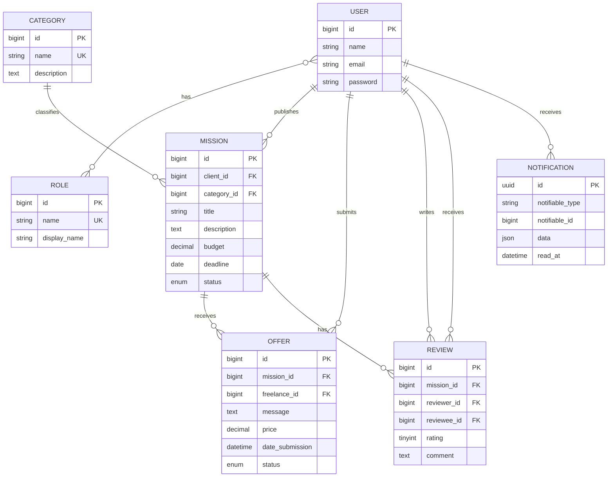

# MCD SkillLink

Le MCD fourni pour SkillLink contient `USER`, `OFFER`, `MISSION`, `CATEGORY`, `REVIEW` et `NOTIFICATION`. Il correspond au cahier des charges.

Dans l'implementation Laravel existante, `OFFER` est represente par le modele et la table `Application/applications` pour conserver les routes et le code metier deja en place. Les equivalences sont:

- `OFFER.message` -> `applications.cover_letter`
- `OFFER.price` -> `applications.proposed_price`
- `OFFER.date_submission` -> `applications.date_submission`
- `OFFER.status` -> `applications.status`

## Entites

- **USER**: utilisateur de la plateforme, client, freelance ou administrateur.
- **ROLE**: role Laratrust attribue a un utilisateur.
- **CATEGORY**: categorie d'une mission.
- **MISSION**: besoin publie par un client.
- **OFFER**: offre envoyee par un freelance pour une mission. Elle est implementee par `Application`.
- **REVIEW**: evaluation d'un utilisateur apres une mission terminee.
- **NOTIFICATION**: notification envoyee a un utilisateur.

## Relations

## Regles metier

- Un client publie ses propres missions.
- Une mission appartient a une categorie et possede le statut `open`, `in_progress`, `completed` ou `cancelled`.
- Un freelance ne peut envoyer qu'une seule application par mission ouverte.
- L'acceptation d'une application passe la mission a `in_progress` et rejette les autres applications en attente.
- Seul le freelance affecte peut terminer une mission.
- Les reviews sont possibles apres completion et sont uniques par mission et reviewer.
